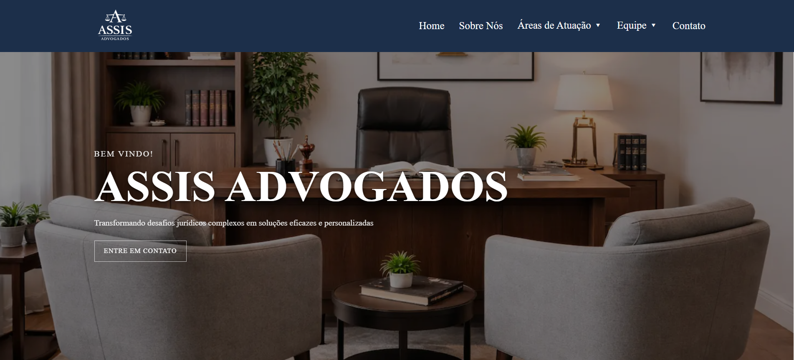

# ⚖️ Assis Advogados — Website Institucional

<p align="center">
  <a href="https://assisfilipee.github.io/Site-Advocacia/" target="_blank">
    
  </a>
</p>

<p align="center">
  🔗 <strong><a href="https://assisfilipee.github.io/Site-Advocacia/" target="_blank">Ver projeto online</a></strong>
</p>

---

## 📌 Sobre o projeto

O **Assis Advogados** é um website institucional desenvolvido com foco em presença digital profissional para escritórios de advocacia.

O projeto foi construído priorizando:

* Identidade visual elegante e confiável
* Performance e carregamento rápido
* Responsividade total (mobile, tablet e desktop)
* Estrutura preparada para SEO
* Experiência do usuário fluida e intuitiva

Este projeto faz parte do portfólio de desenvolvimento front-end voltado para negócios locais e serviços profissionais.

---

## ✨ Funcionalidades

✔️ Layout moderno e institucional
✔️ Menu responsivo com navegação mobile (drawer + accordion)
✔️ Seção de áreas de atuação
✔️ Página individual para cada especialidade
✔️ Seção de equipe
✔️ Formulário de contato
✔️ Animações suaves e interações premium
✔️ Estrutura otimizada para SEO

---

## 🛠️ Tecnologias utilizadas

* **HTML5**
* **CSS3 (Flexbox & Grid)**
* **JavaScript (Vanilla)**
* **Git & GitHub Pages**

---

## 📱 Responsividade

O layout foi desenvolvido seguindo abordagem **mobile-first adaptada**, garantindo ótima experiência em:

* 📱 Smartphones
* 💻 Desktops
* 📟 Tablets

Sem scroll horizontal e com elementos adaptáveis.

---

## ⚙️ Como rodar o projeto localmente

```bash
# Clone o repositório
git clone https://github.com/assisfilipee/Site-Advocacia.git

# Acesse a pasta
cd Site-Advocacia

# Abra o index.html no navegador
```

---

## 📂 Estrutura do projeto

```
Site-Advocacia
│
├── index.html
├── style.css
├── script.js
├── img/
├── civil.html
├── empresarial.html
├── familia.html
├── consumidor.html
├── adv-filipe.html
└── adv-marcos.html
```

---

## 🎯 Objetivo do projeto

Este projeto foi desenvolvido com o objetivo de:

* Demonstrar habilidades em front-end
* Criar um modelo realista para escritórios de advocacia
* Servir como base para projetos comerciais

---

## 👨‍💻 Autor

Desenvolvido por **Filipe Assis**

🌐 Website:
https://filipeassis.dev

💼 LinkedIn:
https://www.linkedin.com/

📧 Contato profissional disponível no site

---

## 📄 Licença

Este projeto está sob a licença MIT.
Sinta-se livre para estudar e utilizar como referência.

---

<p align="center">
  ⭐ Se este projeto te ajudou ou inspirou, considere dar uma estrela no repositório!
</p>
